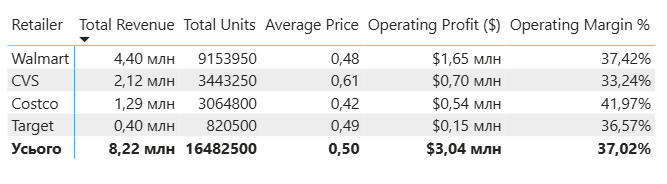
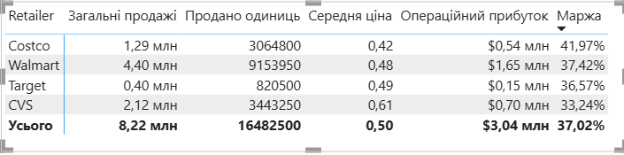

# 📊 Coca-Cola Sales & Financial Analysis (Power BI Project)

**Choose language / Оберіть мову:** [English Version](#english-version) | [Українська версія](#українська-версія)

# English Version

## 📌 Project Overview

This interactive two-page dashboard was designed to analyze the commercial performance and financial metrics of Coca-Cola beverage distribution. The objective of this project is to transform raw transactional data into strategic insights for management, highlighting top-performing products, identifying seasonal trends, discovering business growth opportunities, and performing a deep-dive financial P&L analysis across retailers.

* **Data Source:** Kaggle Dataset

* **Power BI File:** [Download Coca-Cola Analysis](./Coca_Cola_Sales_Analysis.pbix) *(Ensure to keep the file name matching your repository)*

## 📷 Dashboard Pages Preview

### Page 1: Commercial Sales Performance

*Focuses on overall sales dynamics, brand market shares, and geographical performance.*
*(Insert your main dashboard screenshot below)*

### Page 2: Retailer Financial Performance Matrix (P&L Analysis)

*Features a structured profit and loss matrix evaluating sales volume, average price point, operating profit, and product margins.*

## 🛠️ Tech Stack & Skills

* **BI Tool:** Power BI Desktop

* **Formula Language (DAX):** Developed custom KPI measures, safe division formulas, and automated financial metrics (`Total Sales`, `Operating Profit`, `Units Sold`, `Average Price`, and `Operating Margin %`).

* **Data Modeling & Design:** Built robust data relations, optimized visual hierarchy, cross-filtering configuration, and implemented the Z-pattern layout for optimal readability.

* **Metadata & UI Optimization:** Resolved percentage calculation bugs by scaling large numerical values directly inside the UI (display units) rather than dividing in DAX code, maintaining decimal accuracy.

## 📊 Key Business Metrics (KPIs)

* **Total Sales:** $8.22M

* **Operating Profit:** $3.04M

* **Overall Operating Margin:** 37.02%

* **Units Sold:** 16.48M units

## 🔍 Key Insights & Financial Deep-Dive

### 1. Brand & Category Leaders

* **Classic Coca-Cola** is the absolute sales champion, accounting for **23.41%** of total revenue.

* **Dasani Water** follows in second place (**19.95%**), showing strong health-conscious market trends.

### 2. Geographic & Seasonality Trends

* The **West Region** generates the highest share of revenue, while the **Midwest** shows the weakest performance, indicating a critical need for targeted localized marketing.

* A clear **wave-like seasonality trend** is present: sales peak significantly during summer months (June–July) and drop during autumn.

### 3. Retailer P&L Matrix Insights (Page 2)

An analysis of the retail network performance revealed a vital business paradox:

* **Walmart** is our volume giant, bringing in the highest sales (**$4.40M** / 9.15M units sold) but operates at a moderate margin (**37.42%**).

* **Costco** is our efficiency champion: despite generating lower sales volume (**$1.29M** / 3.06M units), it delivers a superior operating margin of **41.97%**, translating to a highly profitable **$0.54M** in operating profit.

* **Target** represents our smallest footprint (**$0.40M** sales) but holds a steady profit margin of **36.57%**, making it a healthy niche performer.

## 💡 Strategic Business Recommendations

1. **Optimize Supply Chain:** Guarantee 100% stock availability during peak summer seasons to prevent loss of premium margin sales.

2. **Review Promotion Strategies:** Restructure trade discounts with high-volume partners (like Walmart) to lift margin percentages, using Costco's 41.97% margin profile as a benchmark.

3. **Midwest Turnaround Plan:** Launch targeted marketing campaigns in the Midwest to tackle local underperformance.

---

# Українська версія

## 📌 Про проєкт

Цей інтерактивний двосторінковий дашборд створено для комплексного аналізу комерційної діяльності та фінансових показників дистрибуції напоїв компанії Coca-Cola. Мета проєкту — трансформувати сирі транзакційні дані у стратегічні інсайти для менеджменту: підсвітити брендів-лідерів, виявити сезонні коливання, розрахувати маржинальність окремих клієнтів (P&L-аналіз) та визначити нові точки росту для бізнесу.

* **Джерело даних:** Kaggle Dataset

## 📷 Скриншоти сторінок дашборду

### Сторінка 1: Комерційний аналіз продажів

*Фокусується на загальній динаміці продажів, частках брендів на ринку та регіональних зрізах.*
*(Вставте скриншот першої сторінки дашборду тут)*

### Сторінка 2: Фінансова матриця ритейлерів (P&L аналіз)

*Структурована фінансова таблиця, яка аналізує фізичні продажі, середню ціну за одиницю, операційний прибуток та відсоткову маржинальність.*

## 🛠️ Технічний стек та навички

* **Інструмент:** Power BI Desktop

* **Мова формул (DAX):** Написання кастомних мір для розрахунку бізнес-показників (`Загальні продажі`, `Продано одиниць`, `Середня ціна`, `Операційний прибуток`, `Маржа`). Використання безпечної функції ділення `DIVIDE` для запобігання помилкам ділення на нуль.

* **Моделювання та UI-дизайн:** Очищення вихідних даних, побудова зв'язків між сутностями, структурування за Z-патерном для зручності сприпяння керівництвом.

* **Робота з метаданими:** Вирішено проблему масштабування чисел (переведення в мільйони на рівні властивостей візуалу, а не через DAX-код), що дозволило зберегти 100% математичну точність при розрахунку маржі.

## 📊 Ключові бізнес-метрики (KPI)

* **Загальні продажі:** $8.22 млн

* **Операційний прибуток:** $3.04 млн

* **Середня маржинальність:** 37.02%

* **Кількість проданих одиниць:** 16.48 млн шт.

## 🔍 Головні висновки (Insights) та Фінансовий аналіз

### 1. Структура продажів брендів

* Абсолютним лідером продажів є **класична Coca-Cola** з часткою **23.41%** у загальному виторгу.

* На другому місці — бренд питної води **Dasani** (**19.95%**), що вказує на сильний тренд споживання здорових продуктів.

### 2. Географія та Сезонність

* Найбільшу частку виторгу забезпечує **Західний регіон (West)**, тоді як **Середній Захід (Midwest)** демонструє найслабші результати і потребує перегляду комерційної стратегії.

* Продажі мають чітко виражений сезонний характер: стрімке зростання влітку (червень–липень) та значний спад восени.

### 3. Аналіз фінансової ефективності ритейлерів (Сторінка 2)

Детальний аналіз P&L-матриці виявив цікаві точки росту для комерційного відділу:

* **Walmart** — це наш найбільший канал збуту. Він приносить **$4.40 млн** виторгу, але має середню маржинальність **37.42%**.

* **Costco** — наш найефективніший партнер. Попри відносно невеликі обсяги продажів (**$1.29 млн** / 3.06 млн штук), він забезпечує преміальну маржинальність у **41.97%**, генеруючи **$0.54 млн** чистого операційного прибутку.

* **Target** демонструє стабільний та здоровий фінансовий профіль із маржею **36.57%** при виторгу **$0.40 млн**.

## 💡 Рекомендації для бізнесу

1. **Захист маржі влітку:** Оптимізувати логістичні ланцюжки під час літнього піка, щоб уникнути дефіциту товару на полицях (Out-of-Stock).

2. **Оптимізація умов з Walmart:** Використати бенчмарк Costco (41.97%), щоб переглянути умови дисконтів для Walmart та підвищити прибутковість комерційного каналу.

3. **Локальний маркетинг:** Провести дослідження ринку в регіоні Midwest та запустити фокусні акції для стимулювання попиту.

**Author / Автор:** Yuliia Kobyliatska

**Connect with me / Зв'язатися зі мною:** [My LinkedIn](https://www.linkedin.com/in/yuliia-kobyliatska)
