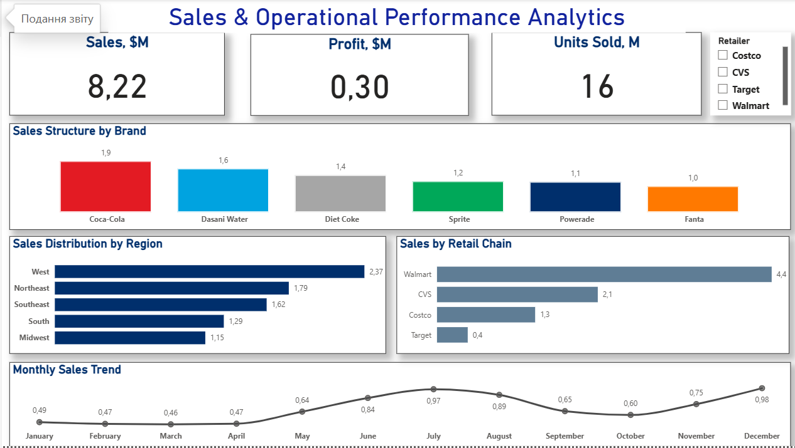
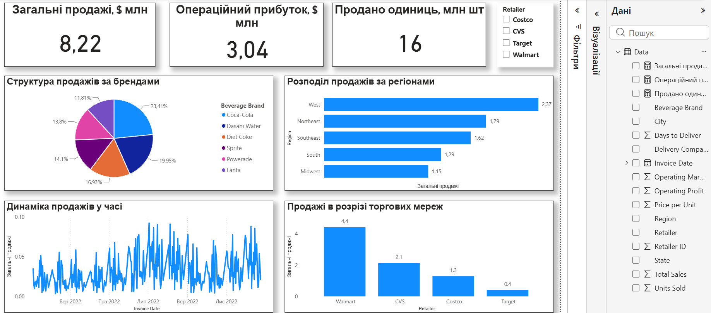

# 📊 Coca-Cola Sales Analysis (Power BI Dashboard)

Choose language / Оберіть мову: [English](#english-version) | [Українська](#українська-версія)

---

## English Version

### 📌 Project Overview
This interactive dashboard was designed to analyze the commercial performance and financial metrics of Coca-Cola beverage distribution. The objective of this project is to transform raw transactional data into strategic insights for management, highlighting top-performing products, identifying seasonal trends, and discovering business growth opportunities.

* **Data Source:** [Kaggle Dataset](https://www.kaggle.com/datasets/sanjanamurthy392/coca-cola-sales-analysis)

### 📷 Dashboard Preview

### 🛠️ Tech Stack & Skills
* **BI Tool:** Power BI Desktop
* **Formula Language:** DAX (developed custom KPI measures, revenue formulas, and scaled operational profit metrics)
* **Data Modeling & Design:** Data cleaning, cross-filtering configuration, visual interactivity optimization, and implementation of the Z-pattern layout.

### 📊 Key Business Metrics (KPIs)
* **Total Sales:** $8.22M
* **Operating Profit:** $3.04M (Margin ~37%)
* **Units Sold:** 16M units

### 🔍 Key Insights
1. **Brand Structure:** Classic **Coca-Cola** is the absolute sales leader (**23.41%**), followed closely by *Dasani Water* (**19.95%**).
2. **Geographic Breakdown:** The **West Region** generates the highest share of revenue, while the *Midwest* shows the weakest performance, signaling a need for a marketing strategy review.
3. **Sales Channels:** **Walmart** stands out as the key retailer, securing the primary sales volume and ensuring steady customer traffic.
4. **Seasonality:** The line chart reveals a clear wave-like trend, with peak sales during the **summer months (June-July)** and a noticeable slowdown in autumn.

### 💡 Business Recommendations
* Optimize logistics and ensure 100% on-shelf availability during the peak summer season.
* Launch joint promotional campaigns with Walmart as the key partner to increase the average order value.
* Conduct an in-depth investigation into the root causes of underperformance in the Midwest region.

---

## Українська версія

### 📌 Про проєкт
Цей інтерактивний дашборд створено для аналізу комерційної діяльності та фінансових показників дистрибуції напоїв компанії Coca-Cola. Мета проєкту — трансформувати сирі транзакційні дані у стратегічні інсайти для менеджменту, підсвітити лідерів продажів, виявити сезонні тренди та знайти точки росту для бізнесу.

* **Джерело даних:** [Kaggle Dataset](https://www.kaggle.com/datasets/sanjanamurthy392/coca-cola-sales-analysis)

### 📷 Скриншот дашборду

### 🛠️ Технічний стек та навички
* **Інструмент:** Power BI Desktop
* **Мова формул:** DAX (створення кастомних мір для KPI, розрахунок продажів та операційного прибутку з урахуванням масштабування)
* **Моделювання даних:** Очищення даних, налаштування крос-фільтрації та інтерактивності візуальних елементів (Z-патерн розташування графіків).

### 📊 Ключові бізнес-метрики (KPI)
* **Загальні продажі:** $8.22 млн
* **Операційний прибуток:** $3.04 млн (Маржинальність ~37%)
* **Кількість проданих одиниць:** 16 млн шт.

### 🔍 Головні висновки (Insights)
1. **Брендова структура:** Класична **Coca-Cola** є абсолютним лідером продажів (**23.41%**), на другому місці — *Dasani Water* (**19.95%**).
2. **Географічний зріз:** Найбільшу частку виторгу генерує **Західний регіон (West)**, тоді як *Середній Захід (Midwest)* демонструє найслабші результати та потребує перегляду маркетингової стратегії.
3. **Канали збуту:** Мережа **Walmart** є ключовим ритейлером, який забезпечує основний обсяг реалізації та стабільність потоку клієнтів.
4. **Сезонність:** На лінійному графіку чітко простежується хвилеподібний тренд із піковими продажами у **літні місяці (червень-липень)** та спадом у осінній період.

### 💡 Рекомендації для бізнесу
* Оптимізувати логістику та забезпечити 100% наявність товару на полицях у піковий літній сезон.
* Запустити спільні промокампанії з ключовим партнером Walmart для збільшення середнього чека.
* Провести додаткове дослідження причин низьких продажів у регіоні Midwest.

---
**Author / Автор:** Yuliia Kobyliatska
* [My LinkedIn / Мій LinkedIn](www.linkedin.com/in/yuliia-kobyliatska)
